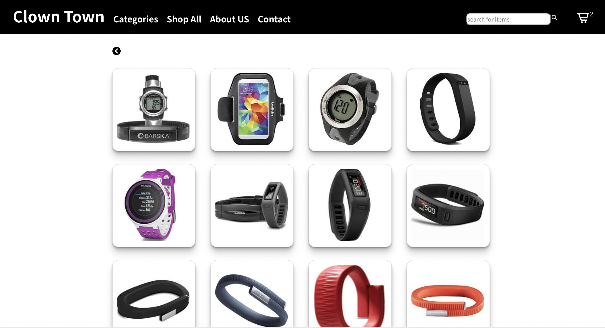
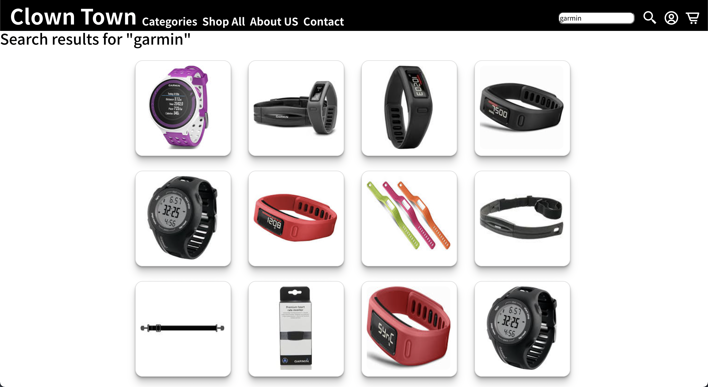
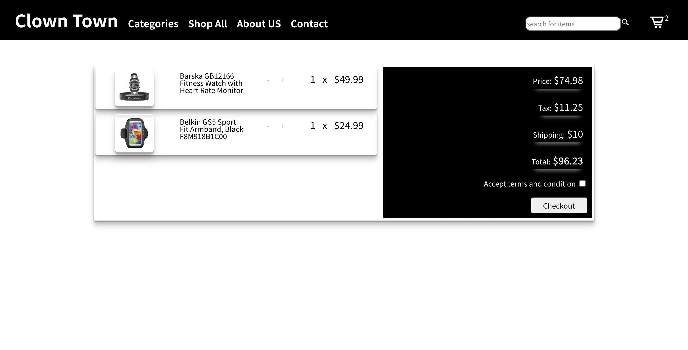

# Wearables E-Commerce Project

## Description

This group project is an e-commerce shop where customers can shop for watches. This web app is fully responsive and data persistent. It was built with React, Node.js, Express and styled using styled-components.

---

## Contributors

Arunava Chowdhury: https://github.com/aruchowdhury

Emmanuel Flambard: https://github.com/emmanuelflambard

Sean Fox: https://github.com/cmdshift4

Andrew Paul: https://github.com/helloandrewpaul


---

## Setup Instructions

Fork and clone the respository into a code editor of your choice.

### _*Starting front-end*_

- open a second terminal and type <code>cd client</code> to access the client directory
- run <code>yarn install</code> to install dependencies
- run <code>yarn start</code> to start the front-end

The front-end will launch here: https://localhost:3000

### _*Front-end dependencies*_

```
  "dependencies": {
    "@testing-library/jest-dom": "^4.2.4",
    "@testing-library/react": "^9.3.2",
    "@testing-library/user-event": "^7.1.2",
    "react": "^16.13.1",
    "react-dom": "^16.13.1",
    "react-icons": "^4.2.0",
    "react-infinite-scroll": "^0.1.5",
    "react-infinite-scroll-component": "^6.1.0",
    "react-modal": "^3.13.1",
    "react-router-dom": "^5.2.0",
    "react-scripts": "3.4.1",
    "styled-components": "^5.3.0"
  },
```

### _*Starting back-end*_

- open a terminal and type <code>cd server</code> to access the server directory
- run <code>yarn install</code> to install dependencies
- run <code>yarn start</code> to start the back-end

The back-end will launch here: https://localhost:4000

### _*Back-end dependencies*_

```
  "dependencies": {
    "body-parser": "^1.19.0",
    "express": "^4.17.1",
    "file-system": "^2.2.2",
    "morgan": "^1.10.0"
  },
```

### _*Endpoints*_

Endpoints are documented in [server/README.md](./API_DOCS.md)

---

## Components

### Categories


> - sort through store items by category

---

### Shop All



> - hover over each item to reveal details, price, stock count and option to an add to the cart
> - if an item is added to the cart, a counter increases next to the cart icon

---

### Search Bar



> - search the store using item keywords

---

### Cart & Checkout



> - each item in the cart displays an item image, details, description, quantity and total price of the order
> - ability to change quantity and remove items from cart
> - total price of order including subtotal and taxes are displayed are checkout

---

## _Guidelines from Concordia Bootcamps below:_

---

[See the list of TEAMS](__documentation/TEAMS.md)

You will make use of _everything_ that you have learned thus far in the bootcamp to build an e-commerce app that will showcase all of the provided _wearables_ items.

The stack is React.Js, Node.Js, and styled-components.

Your node server should be RESTful and follow REST principles, at least to the extent we learned during the bootcamp.

---

**✋ You CANNOT use any external UI libraries, including, but not limited to, Material UI, Bootstrap.**

---

## Getting Started


You have your assignment and your team. What should you do first? This will vary for every team, and even every team member.

**The important thing is to NOT just jump in and start coding!**

There probably shouldn't be any coding until very near the end of the first day.

## Meet your Product Manager!

Each team has been assigned a product manager. This person is in charge of answering questions, guiding you and basically preventing everything from falling apart!

This person should be present for some of your team meetings, but not all. PMs are super busy people and have multiple projects, people to manage. 😉

## Planning

1. You will break into 3 groups (with your assigned PM.)
2. Your PM will answer any initial questions, and give you more information, as required.
3. Breakout into a separate meeting with just your team. _Your PM will bounce from team to team to make sure you're on track._
4. Time to use the [Kickoff Meeting Agenda](__documentation/KICKOFF_MEETING_AGENDA.md)

### First team meeting

It could also be a good/fun idea to give yourselves an original team name. :)

Your first team meeting should start with the [Kickoff Meeting Agenda](__documentation/KICKOFF_MEETING_AGENDa.md).

[Successful Software Project Delivery in 10 Steps](https://www.appnovation.com/blog/successful-software-project-delivery-10-steps).

💡 How a project starts is indicative of how it will end.

## Teamwork

The most important aspect of this project is the ability to work in a team. No matter your contribution to the project, you should understand the **FULL** codebase. This will require that you

- **review** each other's code
- **ask** questions when you don't understand
- **comment** your code extensively. _Always go for clarity over brevity._

## GitHub

see the [GITHUB Document](__documentation/GITHUB.md)
